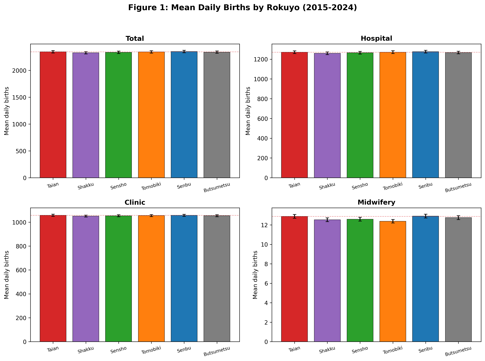
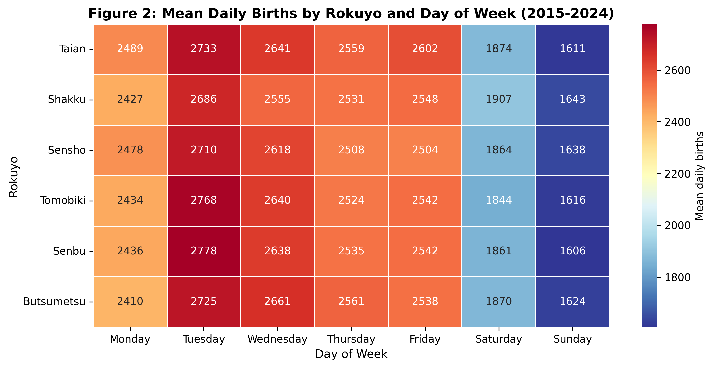
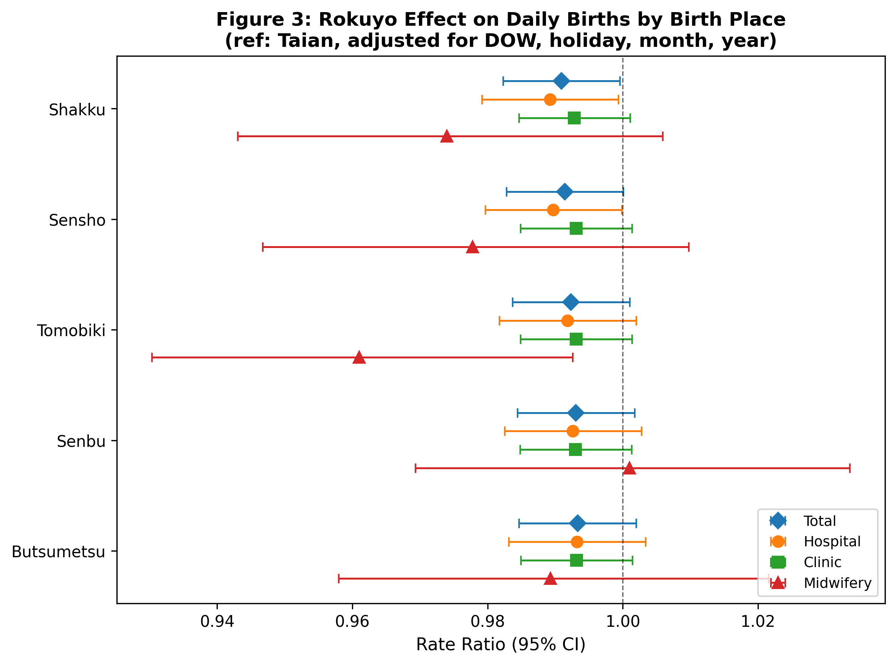
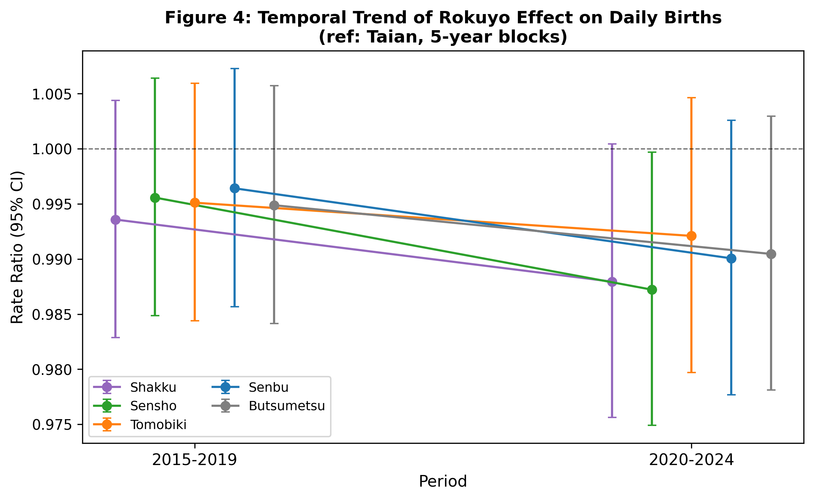

# Rokuyo and Daily Birth Patterns in Japan: A Negative Binomial Regression Analysis of 8.5 Million Births (2015–2024)

**Running title:** Rokuyo and birth patterns in Japan

**Mizuki Shirai, MHS**

Specified Nonprofit Corporation Rehabilitation Collaboration, Suita, Osaka, Japan

**Corresponding author:** Mizuki Shirai, rehabilitation.collaboration@gmail.com

**ORCID:** 0009-0005-3615-0670

## Abstract

**Background:** Rokuyo is a six-day auspiciousness cycle deeply embedded in Japanese culture, with documented effects on behaviors such as hospital discharge timing and wedding scheduling. While auspicious-day preferences have been shown to influence birth timing in Taiwan and China, no study has examined whether rokuyo affects daily birth patterns in Japan.

**Methods:** We conducted a retrospective ecological study using national vital statistics from Japan's e-Stat system (2015–2024, N=8,547,321 births across 3,653 days). Negative binomial regression estimated rate ratios (RR) for each rokuyo day relative to Taian (most auspicious), adjusting for day-of-week, national holidays, month, and year trend. Subgroup analyses stratified by birth place (hospital, clinic, midwifery home). Five sensitivity analyses assessed robustness: exclusion of holiday-adjacent days, exclusion of special periods (New Year, Golden Week, Obon), weekday/weekend stratification, daytime/nighttime stratification, and temporal trend (5-year blocks). Holm correction was applied for multiple comparisons.

**Results:** In the primary analysis, no rokuyo day showed a statistically significant difference in birth count after Holm correction (all RR 0.991–0.993 relative to Taian; all corrected P>0.20). Day-of-week effects were far larger (Tuesday RR=1.090, +9.0% vs. Monday; Sunday RR=0.647, −35.3%). However, sensitivity analysis restricted to weekdays revealed a statistically significant rokuyo effect: all non-Taian days showed 1.1–1.5% fewer births than Taian (RR 0.985–0.989; all Holm-corrected P<0.03). This effect was absent on weekends (all RR≈1.00; all P=1.0), absent at nighttime (all P=1.0), and showed a non-significant daytime trend (P=0.12–0.27). Subgroup analysis of midwifery homes (where cesarean sections are not performed) showed no significant rokuyo effect. No temporal change was detected between 2015–2019 and 2020–2024.

**Conclusions:** The primary analysis found no significant rokuyo effect on daily birth patterns in Japan. However, sensitivity analysis restricted to weekdays revealed a statistically significant but clinically negligible effect, detectable only when scheduled deliveries are possible. The effect size (1.1–1.5% excess births on Taian) is orders of magnitude smaller than effects observed for weddings (Butsumetsu avoidance: −95%) or hospital discharge (Taian preference: +34%), suggesting that medical management of childbirth substantially constrains the influence of calendar-based superstitions on birth timing.

**Keywords:** rokuyo, six-day calendar, birth timing, Japan, superstition, negative binomial regression, cultural beliefs

---

## Introduction

Daily birth counts in Japan are not uniformly distributed across the calendar. The largest population-based analysis to date, by Sassa et al. (2024), examined 21.9 million birth records from 1979 to 2018 and demonstrated pronounced day-of-week patterns: births peak on Tuesday through Friday and drop sharply on weekends and public holidays [1]. Morita et al. (2002) reported similar findings for 1998, showing that maternity homes—where obstetric interventions such as cesarean sections and labor inductions are not performed—exhibited no day-of-week variation, suggesting that the weekly cycle reflects medical scheduling rather than biological labor rhythms [2]. Takahashi et al. (2014) extended these observations to a 30-year series (1981–2010), documenting that the weekday–weekend gap widened over time as obstetric intervention rates increased, and further showed avoidance of specific dates such as April 1 (school-year entry cutoff) [3, 4].

Rokuyo (六曜) is a six-day auspiciousness cycle that has been integrated into the Japanese calendar since the Edo period. The cycle assigns each day one of six labels: Taian (大安, "great peace," the most auspicious), Tomobiki (友引, "friend-pulling"), Sensho (先勝, "first win"), Senbu (先負, "first loss"), Shakku (赤口, "red mouth"), and Butsumetsu (仏滅, "Buddha's death," the most inauspicious). These labels are determined by the lunar calendar: (lunar month + lunar day) mod 6, cycling every six days with resets at lunar month boundaries. Despite its origins in Chinese divination, rokuyo has no extant practice in modern China and is unique to Japanese culture. A 2023 survey by NEXER and Saihokaku found that approximately half (47.7%) of Japanese adults consider rokuyo in daily life, with a higher proportion (59.3%) considering it when scheduling ceremonies [5]. This cultural awareness is reflected in measurable behavior: Hira et al. (1998) demonstrated that hospital discharge rates at Kyoto University Hospital were 34% higher on Taian than on Butsumetsu (25.8 vs. 19.3 discharges/day), with an estimated excess cost of ¥7.4 million over three years [6]. Wedding venue data show near-total avoidance of Butsumetsu for ceremonies (approximately 4.6% of weddings vs. an expected 16.7% under uniform distribution) [7].

The possibility that auspicious-day preferences influence birth timing has been established in other East Asian contexts. Lo (2003) reported a 14% higher cesarean section rate on auspicious dates in Taiwan [8]. Lin et al. (2006) showed that cesarean rates in Taiwan dropped by approximately 5 percentage points during Ghost Month (the seventh lunar month), with the effect concentrated among younger women who had greater discretion over delivery mode [9]. Most directly relevant, Huang et al. (2020) found a 3.9% excess in daily births on numerologically auspicious days in Guangdong Province, China, driven primarily by cesarean sections [10].

Japan itself provides a historical precedent for superstition-driven birth-count changes at an extreme scale. Kaku (1975) documented that the Hinoeuma year of 1966 (Fire Horse, 丙午)—believed to produce women of dangerous temperament—produced approximately 463,000 fewer births than predicted by trend, a 25% decline attributable to birth avoidance and excess induced abortions [11, 12]. This event demonstrates that Japanese reproductive behavior is responsive to calendar-based beliefs, although the Hinoeuma cycle (once per 60 years) is fundamentally different in periodicity from rokuyo (every 6 days).

Despite the documented influence of rokuyo on other health-related behaviors and the demonstrated effects of auspicious-day beliefs on birth timing in other East Asian populations, no study has examined whether rokuyo affects daily birth patterns in Japan. This study addresses that gap using 10 years of national vital statistics data, with a particular focus on distinguishing scheduled from unscheduled deliveries through stratification by birth place and time of day.

---

## Methods

### Study Design

We conducted a retrospective ecological study using population-level birth data from Japan's national vital statistics system to test whether daily birth counts differ across the six rokuyo days.

### Data Source

Data were obtained from the Japanese Ministry of Health, Labour and Welfare Population Dynamics Statistics (保管統計表 出生7, statistical table ID 0003411915) via the e-Stat API. The dataset covers January 1, 2015 to December 31, 2024 (10 years, 3,653 days) and contains daily birth counts stratified by birth place (hospital, clinic [診療所], midwifery home [助産所], home, and other) and hour of birth (0–23). All data are publicly available and fully aggregated; no individual-level records were accessed. The raw dataset comprised 624,000 records (birth place × month × day × hour × year combinations). Of these, 88,320 records with zero births (corresponding to structurally empty cells such as nighttime hours at midwifery homes) were excluded during parsing, yielding 535,680 valid records that were aggregated to 21,918 daily observations (3,653 days × 6 birth place categories).

### Rokuyo Calculation

Each date was assigned a rokuyo label using the Japanese traditional calendar (旧暦). The solar-to-lunar conversion was performed using the qreki algorithm, which implements the Japanese lunisolar calendar system (as distinct from the Chinese agricultural calendar). The rokuyo index was calculated as (lunar month + lunar day) mod 6, mapped to Taian (0), Shakku (1), Sensho (2), Tomobiki (3), Senbu (4), and Butsumetsu (5). To validate the implementation, we cross-checked against the Python lunardate library (which implements the Chinese agricultural calendar), identifying discrepancies in 149 of 3,653 dates (4.08%) near lunar month boundaries—confirming the necessity of using the Japanese-specific algorithm.

### Statistical Analysis

The primary analysis used negative binomial regression to model daily birth counts:

> log(E[births_d]) = β₀ + β_rokuyo × Rokuyo(d) + β_dow × DOW(d) + β_holiday × Holiday(d) + β_month × Month(d) + β_year × Year(d)

where Rokuyo(d) was represented by five dummy variables (reference: Taian), DOW(d) by six dummy variables (reference: Monday), Holiday(d) was a binary indicator for national holidays (defined by the Japanese national holiday law; weekends were captured by DOW dummies), Month(d) by 11 dummy variables (reference: January), and Year(d) as a centered linear trend. Negative binomial regression was chosen over Poisson regression based on a likelihood ratio test confirming overdispersion (P<0.001). The covariate set follows established precedent from prior studies of Japanese birth patterns [1–3]. All tests were two-sided. Statistical significance was set at α = 0.05.

Rate ratios (RR = exp(β)) with 95% confidence intervals were calculated for each rokuyo day relative to Taian. Holm correction was applied independently within each analysis to the five pairwise rokuyo comparisons (reference: Taian) to control the family-wise error rate. As the study uses the complete national dataset, no a priori power calculation was performed; the sample of 8.5 million births across 3,653 days provides sufficient precision to detect effects of <1%.

### Subgroup Analysis

Pre-specified subgroup analyses were repeated separately for three birth place categories: hospitals (病院), clinics (診療所), and midwifery homes (助産所). Midwifery homes serve as a negative control because cesarean sections cannot be performed in these facilities, eliminating scheduled surgical delivery as a potential mechanism for rokuyo-driven birth timing.

### Sensitivity Analyses

Five pre-specified sensitivity analyses assessed the robustness of the primary findings:

1. **Holiday-adjacent exclusion (S1):** Removed days within ±1 day of a national holiday (N=3,204 remaining days) to eliminate potential confounding by holiday-adjacent scheduling shifts.
2. **Special period exclusion (S2):** Removed New Year (December 29–January 3), Golden Week (April 29–May 5), and Obon (August 13–16) (N=3,483 remaining days).
3. **Weekday/weekend stratification (S3):** Separate models for weekdays only (Monday–Friday, N=2,609 days) and weekends only (Saturday–Sunday, N=1,044 days).
4. **Daytime/nighttime stratification (S4):** Births during 9:00–16:59 (proxy for scheduled deliveries) versus all other hours, aggregated to daily totals.
5. **Temporal trend (S5):** Separate models for 2015–2019 (N=1,826 days) and 2020–2024 (N=1,827 days).

### Ethical Considerations

This study used exclusively publicly available, fully aggregated population-level data from the e-Stat system. No individual-level data were accessed. Under the Japanese Ethical Guidelines for Medical and Biological Research Involving Human Subjects (Ministry of Education, Culture, Sports, Science and Technology; Ministry of Health, Labour and Welfare, 2021 revision), research using publicly available aggregate statistics does not require ethics committee review (Article 3, Paragraph 1, Item 1). As no human subjects were involved, no institutional review board approval or waiver was sought. This study was conducted in accordance with the principles of the Declaration of Helsinki where applicable to research using aggregate data.

### Software

All analyses were performed using Python 3.14.3 with pandas, NumPy, statsmodels 0.14.4, qreki, jpholiday, and matplotlib. Analysis code will be available at https://github.com/rehabilitation-collaboration/rokuyo-birth.

---

## Results

### Study Population

The dataset comprised 8,547,321 live births over 3,653 days (January 1, 2015 to December 31, 2024), with a mean of 2,339.8 births per day (standard deviation [SD] 535.9; range 1,063–3,679). Each rokuyo day occurred 607–610 times over the study period, confirming near-uniform distribution (expected: 609 each).

### Descriptive Statistics

Mean daily births showed minimal variation across rokuyo days: Taian 2,345.6, Senbu 2,350.6, Tomobiki 2,342.7, Butsumetsu 2,337.9, Sensho 2,335.3, and Shakku 2,326.9 (Table 1, Figure 1). The maximum difference from the Taian mean was 0.80% (Shakku), compared with a 68.4% range across days of the week (Tuesday 2,732.8 vs. Sunday 1,622.9). The rokuyo × day-of-week heatmap (Figure 2) confirmed that day-of-week variation dominated the data structure with no visible rokuyo interaction.

By birth place, the same pattern held for hospitals (mean 1,260.0–1,276.2/day; total approximately 4.6 million births) and clinics (1,051.0–1,057.9/day; approximately 3.8 million births). Midwifery homes had substantially lower volumes (mean 12.4–12.9/day; approximately 46,000 births).

### Primary Analysis

Negative binomial regression of total daily births showed no statistically significant rokuyo effect after Holm correction (Table 2, Figure 3). All rate ratios were between 0.991 and 0.993 relative to Taian, with Holm-corrected P-values ranging from 0.20 to 0.25. The model converged normally with mild overdispersion (negative binomial [NB] dispersion α=0.0056; likelihood ratio test vs. Poisson: χ²=33,132, df=1, P<0.001; AIC=48,257; log-likelihood=−24,103). The Durbin-Watson statistic for Pearson residuals was 1.16, indicating positive temporal autocorrelation (see Limitations).

In contrast, day-of-week effects were far larger: the Tuesday peak (RR=1.090, 95% CI 1.079–1.100; P<0.001) represented a +9.0% deviation from Monday, compared to a maximum rokuyo deviation of 0.9%, while Sunday births were 35.3% lower (RR=0.647, 95% CI 0.641–0.653; P<0.001). The national holiday effect was RR=0.715 (0.707–0.724; P<0.001).

### Subgroup Analysis by Birth Place

Hospital births showed marginally significant rokuyo effects before Holm correction (Shakku RR=0.989, uncorrected P=0.037; Sensho RR=0.990, P=0.047) but all became non-significant after correction (all Holm P>0.18). Clinic births showed a uniform pattern with all RRs at 0.993 (all Holm P>0.44). Midwifery home births—the negative control—showed no significant effects (all Holm P>0.08), though Tomobiki showed a suggestive RR of 0.961 (uncorrected P=0.016, Holm P=0.080) which may reflect low statistical power (mean 12.7 births/day).

### Sensitivity Analyses

The five sensitivity analyses revealed a clear pattern distinguishing scheduled from unscheduled deliveries (Table 3).

**Weekday/weekend stratification (S3):** On weekdays, when scheduled deliveries (inductions and cesarean sections) are feasible, all rokuyo days showed significantly fewer births than Taian (RR 0.985–0.989; all Holm-corrected P<0.03). On weekends, when scheduling is constrained, no rokuyo effect was detected (all RR≈1.00; all P=1.0). This was the most informative sensitivity analysis, demonstrating that the rokuyo effect is masked in the primary analysis by the overwhelming day-of-week variation but emerges when this confounder is removed by restriction.

**Holiday-adjacent exclusion (S1):** After removing days within ±1 of national holidays, all rokuyo days showed nominally significant effects (RR 0.987–0.991; all Holm P<0.02). However, this model failed to converge (convergence flag=False), meaning the parameter estimates may be unreliable. These results are reported for completeness but should not be used for inference.

**Special period exclusion (S2):** After removing New Year, Golden Week, and Obon, Senbu showed a significant effect (RR=0.990; Holm P=0.038), with other days showing borderline significance (Holm P=0.05–0.06).

**Daytime/nighttime stratification (S4):** Daytime births (9:00–16:59, proxy for scheduled deliveries) showed a non-significant trend toward rokuyo effects (Shakku RR=0.986, Holm P=0.12), while nighttime births showed no effect (all Holm P=1.0).

**Temporal trend (S5):** Neither the 2015–2019 nor 2020–2024 period showed significant rokuyo effects independently (all Holm P>0.22), and no temporal change in effect magnitude was detected (Figure 4).

---

## Discussion

### Principal Findings

This study found that rokuyo—the Japanese six-day auspiciousness calendar—has no significant overall effect on daily birth patterns, but sensitivity analysis restricted to weekdays revealed a statistically significant though clinically negligible influence. The effect is detectable only under specific conditions: on weekdays, when hospitals and clinics can schedule deliveries, approximately 1.1–1.5% more births occur on Taian (the most auspicious day) than on other rokuyo days. This effect disappears entirely on weekends, at nighttime, and in midwifery homes where cesarean sections are not available.

### The Win-Win Interpretation

This finding can be interpreted as informative regardless of which aspect is emphasized. The presence of a statistically significant weekday effect suggests that rokuyo beliefs may influence obstetric scheduling—some fraction of scheduled deliveries appear to be timed to coincide with auspicious days. However, the effect size (1–1.5%) is orders of magnitude smaller than rokuyo effects observed in other medical domains. Hira et al. (1998) found a 34% increase in hospital discharges on Taian relative to Butsumetsu [6], and wedding venue data show near-total avoidance of Butsumetsu (approximately 95% fewer than expected) [7]. The minimal birth-timing effect suggests that the medical necessities of childbirth—the unpredictability of labor onset, clinical indications for delivery timing, and the limited flexibility of operating room schedules—substantially constrain the expression of calendar-based preferences that operate freely in other life domains.

### Comparison with East Asian Studies

The rokuyo effect on births in Japan (RR≈0.985–0.989 on non-Taian weekdays, equivalent to a 1.1–1.5% excess on Taian) is substantially smaller than effects documented in other East Asian populations. Huang et al. (2020) found 3.9% excess births on auspicious days in Guangdong, China, driven primarily by cesarean sections [10]. Lo (2003) reported a 14% higher cesarean rate on auspicious dates in Taiwan [8]. Lin et al. (2006) documented a 5-percentage-point reduction in cesarean rates during Ghost Month in Taiwan [9].

Several factors may explain this difference. First, the cesarean section rate in Japan (approximately 20–25% per OECD Health Statistics) is lower than in Taiwan (approximately 35% per national statistics) and Guangdong, which may limit the scope for scheduling-based manipulation. Second, rokuyo is a rotating six-day cycle with relatively weak normative pressure compared to the Chinese zodiac or Ghost Month—the latter involves explicit fear of spiritual harm to newborns, a more powerful motivator than a general preference for auspicious timing. Third, Japan's universal health coverage system and standardized obstetric protocols may provide less latitude for patient-driven delivery scheduling than systems with higher rates of elective cesarean sections.

### Mechanism: Scheduled Deliveries as the Pathway

The convergent evidence from our stratified analyses—weekday-only significance, weekend null, nighttime null, daytime trend, midwifery-home null—supports a single mechanism: scheduled deliveries. On weekdays during business hours, obstetricians have the option to schedule inductions or cesarean sections, and a small fraction of these may be timed with rokuyo in mind. On weekends, at night, and in midwifery homes, this scheduling flexibility does not exist, and the rokuyo signal disappears. This interpretation aligns with Morita et al.'s (2002) finding that day-of-week variation in births is absent in midwifery homes [2] and with Takahashi et al.'s (2014) observation that the weekday–weekend birth gap has widened over time as obstetric intervention rates have increased [3].

### The Rokuyo Effect in Historical Context

The 1.1–1.5% birth-timing effect documented here represents the "everyday" end of a spectrum of superstition-driven demographic changes in Japan. At the extreme end, the Hinoeuma (Fire Horse) year of 1966 produced a 25% decline in births [11, 12]. Between these extremes, the rokuyo effect on hospital discharge (34%) and wedding timing (>90% Butsumetsu avoidance) occupy intermediate positions. This gradient likely reflects the degree of individual agency: wedding dates are entirely elective, discharge dates are semi-elective, and birth timing is primarily determined by biological processes with limited scheduling flexibility.

### Strengths and Limitations

This study has several strengths. First, it uses a complete national dataset of over 8.5 million births across 10 years, providing ample statistical power to detect even small effects. Second, the negative binomial regression framework simultaneously adjusts for the major confounders of day-of-week, holiday, month, and year. Third, the stratified analyses (weekday/weekend, daytime/nighttime, birth place) provide mechanistic insight beyond a simple association test. Fourth, the use of the qreki algorithm for lunar calendar conversion, validated against an independent library, ensures accurate rokuyo assignment.

Several limitations should be noted. First, this is an ecological study; we cannot identify which individual births were deliberately scheduled based on rokuyo considerations. Individual-level survey data linking rokuyo beliefs to delivery preferences would provide stronger evidence. Second, the data cover 2015–2024 only; extending to earlier decades (1980–2014) would increase power and enable secular trend analysis over a longer period. Third, we cannot directly distinguish elective cesarean sections from medically indicated ones, as the e-Stat data do not include delivery mode. The birth-place stratification (midwifery home as negative control) partially addresses this limitation. Fourth, the S1 analysis (holiday-adjacent exclusion) did not converge, and its results—while consistent with other analyses—should be interpreted with caution. Fifth, the midwifery-home analysis has limited statistical power due to small daily birth counts (mean 12.7/day), and the suggestive Tomobiki finding (Holm P=0.08) warrants investigation with a larger dataset. Sixth, we did not have data on the reasons for cesarean section scheduling, and cannot exclude the possibility that rokuyo preferences operate through informal conversations between patients and physicians that are not captured in administrative data. Seventh, the Durbin-Watson statistic (1.16) indicates positive temporal autocorrelation in model residuals, which is expected in daily time-series data and may lead to underestimated standard errors. While this does not affect point estimates, the confidence intervals and P-values may be anti-conservative. This is particularly relevant for the weekday-only sensitivity analysis (S3), where the smallest Holm-corrected P-value was 0.013—significant at α=0.05 but potentially non-significant under autocorrelation-robust inference. Future studies should address this using Newey-West heteroscedasticity- and autocorrelation-consistent (HAC) standard errors or autoregressive model terms.

### Public Health Implications

Our findings suggest that rokuyo beliefs, while culturally significant, do not materially alter the distribution of births across the calendar. The 1.1–1.5% weekday effect is too small to affect obstetric resource allocation or staffing. This contrasts with the substantial day-of-week effect (Sunday births 35% lower than Monday), which has direct implications for weekend obstetric staffing, and the holiday effect (28.5% reduction), which affects holiday coverage planning. From a clinical perspective, the rokuyo effect does not raise concerns about medically unnecessary interventions at a population level, though individual cases of rokuyo-motivated delivery scheduling cannot be excluded.

---

## References

[1] Sassa M, Kinoshita R, Murano Y, Shoji H, Yoneoka D. Holiday effect on childbirth: A population-based analysis of 21,869,652 birth records, 1979–2018. PLoS One. 2024;19(2):e0296403. doi:10.1371/journal.pone.0296403

[2] Morita N, Matsushima N, Ogata N, Saeki K, Ishibashi M, Komukai H, Matsuda R, Kurumatani N. Nationwide description of live Japanese births by day of the week, hour, and location. J Epidemiol. 2002;12(4):330–335. doi:10.2188/jea.12.330

[3] Takahashi M, Nishina M, Ohta A. The effect of determining birthdays by social factors such as maternal preference on the distribution in the number of daily live births. Nihon Koshu Eisei Zasshi. 2014;61(1):16–29.

[4] Takahashi M. The distinctive characteristics of the hourly distribution of live births on specific days in Japan. Environ Health Prev Med. 2016;21:501–522. doi:10.1007/s12199-016-0560-0

[5] NEXER and Saihokaku (Mie Heian-kaku). Survey on rokuyo awareness in ceremonial planning [Internet]. PR Times. 2023 [cited 2026 Mar 22]. Available from: https://prtimes.jp/main/html/rd/p/000000869.000044800.html

[6] Hira K, Fukui T, Endoh A, Rahman M, Maekawa M. Influence of superstition on the date of hospital discharge and medical cost in Japan: retrospective and descriptive study. BMJ. 1998;317(7174):1680–1683. doi:10.1136/bmj.317.7174.1680

[7] Zexy. Zexy Kekkon Trend Chosa (Zexy Wedding Trend Survey) [Internet]. Recruit Co., Ltd.; [cited 2026 Mar 22]. Available from: https://souken.zexy.net/research/trend.html

[8] Lo JC. Patients' attitudes vs. physicians' determination: implications for cesarean sections. Soc Sci Med. 2003;57(1):91–96. doi:10.1016/S0277-9536(02)00301-5

[9] Lin HC, Xirasagar S, Tung YC. Impact of a cultural belief about ghost month on delivery mode in Taiwan. J Epidemiol Community Health. 2006;60(6):522–526. doi:10.1136/jech.2005.041475

[10] Huang C, Ma X, Zhang S, Zhao Q. Numerological preferences, timing of births and the long-term effect on schooling. J Popul Econ. 2020;33(2):531–554. doi:10.1007/s00148-019-00758-1

[11] Kaku K. Were Japanese affected by the Hinoeuma superstition? Ann Hum Biol. 1975;2(2):111–115. doi:10.1080/03014467500000651

[12] Kaku K, Matsumoto YS. Influence of a folk superstition on fertility of Japanese in California and Hawaii, 1966. Am J Public Health. 1975;65(2):170–174. doi:10.2105/ajph.65.2.170

[13] Ministry of Health, Labour and Welfare. Population Dynamics Statistics [Internet]. Tokyo: e-Stat; [cited 2026 Mar 22]. Available from: https://www.e-stat.go.jp/

---

## Acknowledgments

This manuscript was drafted with the assistance of Claude Opus 4 (Anthropic), a large language model. The AI assisted with literature review, statistical code generation, and manuscript drafting. All analyses, interpretations, and final editorial decisions were made by the human author. References were checked against PubMed and publisher databases; any errors remain the responsibility of the author.

## Author Contributions (CRediT)

**Mizuki Shirai:** Conceptualization, Methodology, Software, Formal Analysis, Investigation, Data Curation, Writing – Original Draft, Writing – Review & Editing, Visualization, Project Administration.

## Conflict of Interest

The author declares no conflicts of interest per ICMJE guidelines.

## Funding

This research received no external funding.

## Data Availability

All data used in this study are publicly available from the Japanese e-Stat system (https://www.e-stat.go.jp/, statistical table ID 0003411915) [13]. Analysis code is available at https://github.com/rehabilitation-collaboration/rokuyo-birth.

## Figure Legends

**Figure 1.** Mean daily births by rokuyo, stratified by birth place (2015–2024). Error bars represent standard errors of the mean. Dashed horizontal line indicates the Taian mean. Panels: (A) Total, (B) Hospital, (C) Clinic, (D) Midwifery home.

**Figure 2.** Heatmap of mean daily births by rokuyo (rows) and day of week (columns) for total births (2015–2024). Day-of-week variation dominates the pattern, with no visible rokuyo × day-of-week interaction.

**Figure 3.** Forest plot of rokuyo rate ratios (95% CI) from negative binomial regression, stratified by birth place. Reference: Taian. Dashed vertical line at RR=1.0.

**Figure 4.** Temporal trend of rokuyo rate ratios by 5-year blocks (2015–2019 vs. 2020–2024). No significant change in effect magnitude was detected.

